# 🚀 Food D2C - Payment & Subscription Flow PRD

## 📋 **Product Requirements Document**

### **Version:** 1.0
### **Date:** March 21, 2026
### **Author:** Food D2C Team
### **Status:** Ready for Implementation

---

## 🎯 **1. Executive Summary**

### **1.1 Problem Statement**
Food D2C requires a robust, scalable payment and subscription system to handle:
- One-time food box purchases
- Recurring subscription deliveries
- Real-time payment processing
- Customer subscription management
- Automated billing cycles

### **1.2 Solution Overview**
A comprehensive payment ecosystem built on Razorpay, featuring:
- Secure payment processing
- Flexible subscription management
- Real-time webhook integration
- Customer self-service portal
- Automated revenue recognition

### **1.3 Business Objectives**
- **Increase MRR** by 40% through subscription offerings
- **Reduce payment failures** by 60% with automated retries
- **Improve customer retention** by 35% with flexible management
- **Scale to 10,000+ active subscriptions**
- **Achieve 99.9% payment uptime**

---

## 🏗️ **2. High-Level Architecture**

### **2.1 Monolith System Architecture**

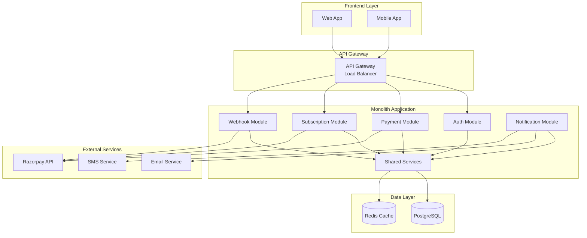

### **2.2 Monolith Advantages**

| Advantage | Benefit for Food D2C |
|-----------|---------------------|
| **Simplicity** | Single codebase, easier development |
| **Performance** | No network latency between services |
| **Debugging** | Easier to trace and debug issues |
| **Deployment** | Single deployment unit |
| **Cost Effective** | Lower infrastructure costs |
| **Fast Development** | Rapid feature delivery |

### **2.3 Technology Stack**

| Layer | Technology | Purpose |
|-------|------------|---------|
| **Frontend** | React + TypeScript | Customer interface |
| **Backend** | NestJS + TypeScript | Monolith application |
| **Database** | PostgreSQL | Primary data store |
| **Cache** | Redis | Session & query caching |
| **Payment** | Razorpay | Payment processing |
| **Webhooks** | Integrated handlers | Real-time updates |
| **Auth** | JWT | Authentication |
| **Infrastructure** | Docker + AWS | Deployment |

### **2.4 Monolith Module Structure**

```
src/
├── auth/                 # Authentication module
│   ├── auth.controller.ts
│   ├── auth.service.ts
│   └── auth.module.ts
├── payments/             # Payment module
│   ├── payments.controller.ts
│   ├── payments.service.ts
│   └── payments.module.ts
├── subscriptions/        # Subscription module
│   ├── subscriptions.controller.ts
│   ├── subscriptions.service.ts
│   └── subscriptions.module.ts
├── webhooks/            # Webhook module
│   ├── webhook.controller.ts
│   ├── webhooks.service.ts
│   └── webhooks.module.ts
├── notifications/       # Notification module
│   ├── notifications.service.ts
│   └── notifications.module.ts
├── shared/              # Shared services
│   ├── database/
│   ├── cache/
│   ├── logging/
│   └── utils/
└── app.module.ts        # Root module
```

---

## 🔄 **3. Detailed Payment Flow**

### **3.1 One-Time Payment Flow (Monolith)**

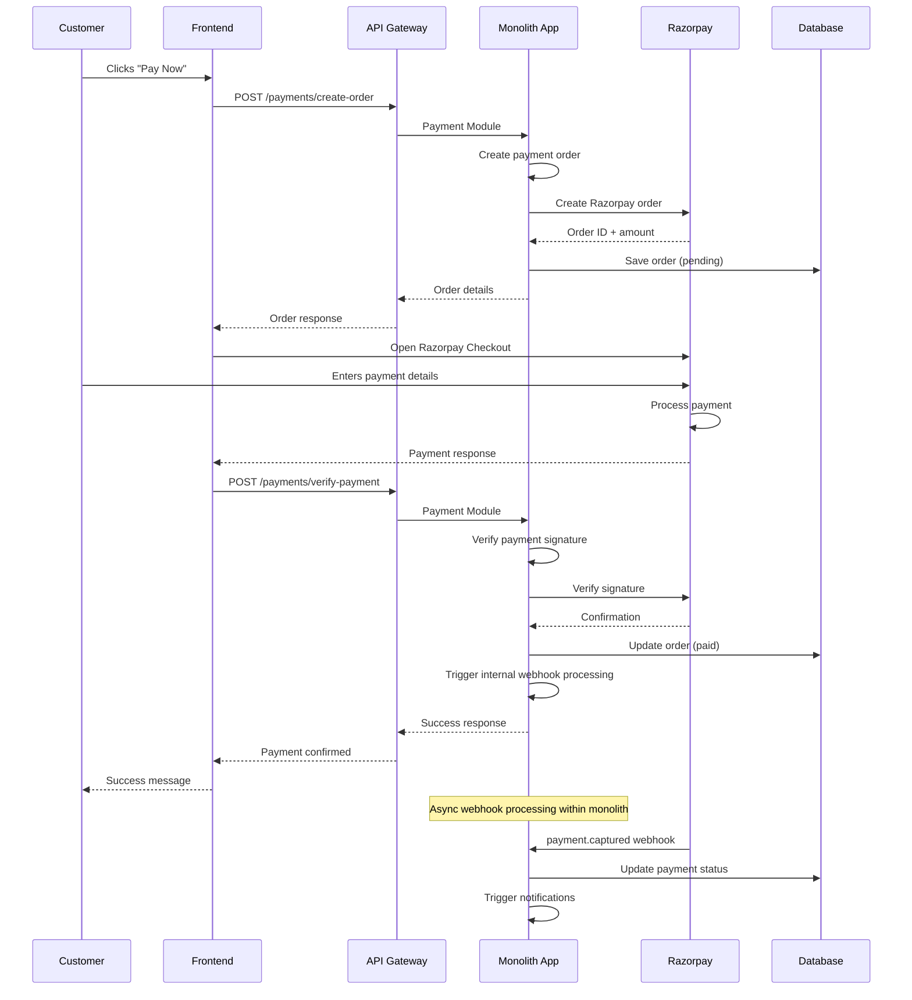

### **3.2 Subscription Creation Flow (Monolith)**

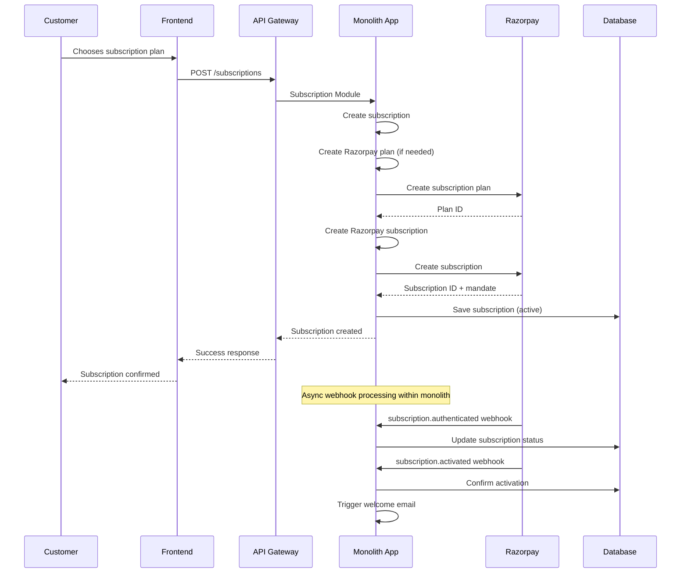

### **3.3 Recurring Payment Flow (Monolith)**

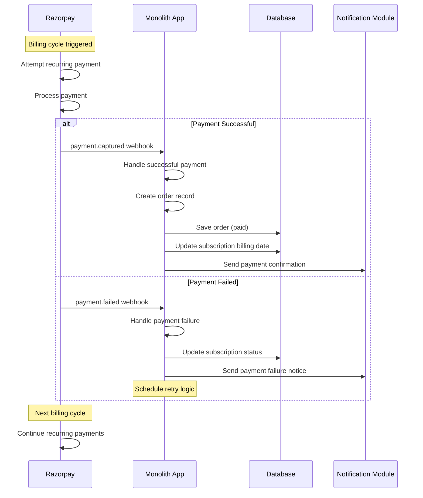

---

## 🎨 **4. Low-Level Architecture**

### **4.1 Database Schema**

```sql
-- Users Table
CREATE TABLE users (
    id UUID PRIMARY KEY DEFAULT gen_random_uuid(),
    email VARCHAR(255) UNIQUE NOT NULL,
    password_hash VARCHAR(255) NOT NULL,
    first_name VARCHAR(100),
    last_name VARCHAR(100),
    phone VARCHAR(20),
    role VARCHAR(50) DEFAULT 'customer',
    is_active BOOLEAN DEFAULT true,
    created_at TIMESTAMP DEFAULT CURRENT_TIMESTAMP,
    updated_at TIMESTAMP DEFAULT CURRENT_TIMESTAMP
);

-- Subscriptions Table
CREATE TABLE subscriptions (
    id UUID PRIMARY KEY DEFAULT gen_random_uuid(),
    user_id UUID REFERENCES users(id) ON DELETE CASCADE,
    name VARCHAR(255) NOT NULL,
    interval VARCHAR(20) NOT NULL CHECK (interval IN ('weekly', 'monthly')),
    amount DECIMAL(10,2) NOT NULL,
    status VARCHAR(20) NOT NULL CHECK (status IN ('active', 'paused', 'cancelled', 'expired')),
    razorpay_subscription_id VARCHAR(255) UNIQUE,
    razorpay_plan_id VARCHAR(255),
    next_billing_date TIMESTAMP,
    total_deliveries INTEGER DEFAULT 0,
    created_at TIMESTAMP DEFAULT CURRENT_TIMESTAMP,
    updated_at TIMESTAMP DEFAULT CURRENT_TIMESTAMP
);

-- Orders Table
CREATE TABLE orders (
    id UUID PRIMARY KEY DEFAULT gen_random_uuid(),
    user_id UUID REFERENCES users(id) ON DELETE CASCADE,
    subscription_id UUID REFERENCES subscriptions(id) ON DELETE SET NULL,
    total_amount DECIMAL(10,2) NOT NULL,
    items JSONB,
    status VARCHAR(20) NOT NULL CHECK (status IN ('pending', 'confirmed', 'delivered', 'cancelled')),
    payment_status VARCHAR(20) NOT NULL CHECK (payment_status IN ('pending', 'paid', 'failed', 'refunded')),
    razorpay_order_id VARCHAR(255) UNIQUE,
    razorpay_payment_id VARCHAR(255),
    delivery_date TIMESTAMP,
    created_at TIMESTAMP DEFAULT CURRENT_TIMESTAMP,
    updated_at TIMESTAMP DEFAULT CURRENT_TIMESTAMP
);

-- Webhook Events Table
CREATE TABLE webhook_events (
    id UUID PRIMARY KEY DEFAULT gen_random_uuid(),
    event_type VARCHAR(100) NOT NULL,
    razorpay_event_id VARCHAR(255) UNIQUE,
    payload JSONB NOT NULL,
    processed BOOLEAN DEFAULT false,
    created_at TIMESTAMP DEFAULT CURRENT_TIMESTAMP
);
```

### **4.2 API Endpoints**

#### **Authentication**
```typescript
POST /auth/register
POST /auth/login
POST /auth/refresh
POST /auth/logout
```

#### **Payments**
```typescript
POST /payments/create-order
POST /payments/verify-payment
POST /payments/create-subscription-plan
POST /payments/create-subscription
GET /payments/orders/:id
```

#### **Subscriptions**
```typescript
GET /subscriptions/my
POST /subscriptions
GET /subscriptions/:id
PUT /subscriptions/:id/pause
PUT /subscriptions/:id/resume
PUT /subscriptions/:id/cancel
GET /subscriptions/:id/billing-history
```

#### **Webhooks**
```typescript
POST /webhooks/razorpay
POST /webhooks/razorpay/test
GET /webhooks/events
POST /webhooks/retry/:eventId
```

### **4.3 Monolith Service Architecture**

```typescript
// Monolith App Structure
@Injectable()
export class PaymentsService {
  async createOrder(amount: number, userId: string): Promise<Order>
  async verifyPayment(paymentData: PaymentVerificationDto): Promise<boolean>
  async createSubscriptionPlan(planData: PlanDto): Promise<Plan>
  async createSubscription(planId: string, userId: string): Promise<Subscription>
  async handleWebhookEvent(eventType: string, payload: any): Promise<void>
}

@Injectable()
export class SubscriptionsService {
  async createSubscription(subscriptionData: CreateSubscriptionDto): Promise<Subscription>
  async pauseSubscription(id: string): Promise<Subscription>
  async resumeSubscription(id: string): Promise<Subscription>
  async cancelSubscription(id: string): Promise<Subscription>
  async updateBilling(id: string): Promise<Subscription>
  async getUserSubscriptions(userId: string): Promise<Subscription[]>
}

@Injectable()
export class WebhooksService {
  async processWebhookEvent(webhookData: any): Promise<void>
  async verifySignature(payload: string, signature: string): Promise<boolean>
  async handlePaymentCaptured(payload: any): Promise<void>
  async handleSubscriptionEvent(eventType: string, payload: any): Promise<void>
}

@Injectable()
export class NotificationsService {
  async sendEmail(template: string, data: any): Promise<void>
  async sendSMS(phone: string, message: string): Promise<void>
  async sendPushNotification(userId: string, notification: any): Promise<void>
}

// Shared Services
@Injectable()
export class DatabaseService {
  // Shared database operations
}

@Injectable()
export class CacheService {
  // Shared caching operations
}

@Injectable()
export class LoggingService {
  // Shared logging operations
}
```

### **4.4 Monolith Module Dependencies**

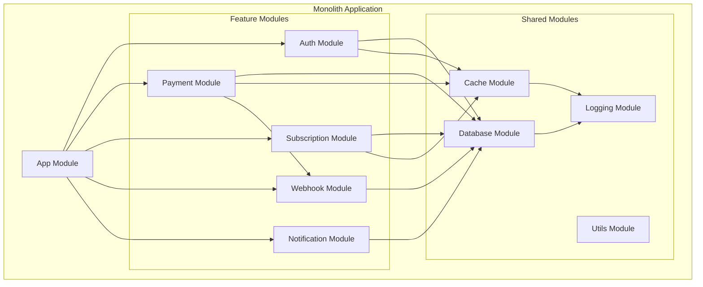

---

## 🔧 **5. Component-Level Flow**

### **5.1 Payment Component Architecture (Monolith)**

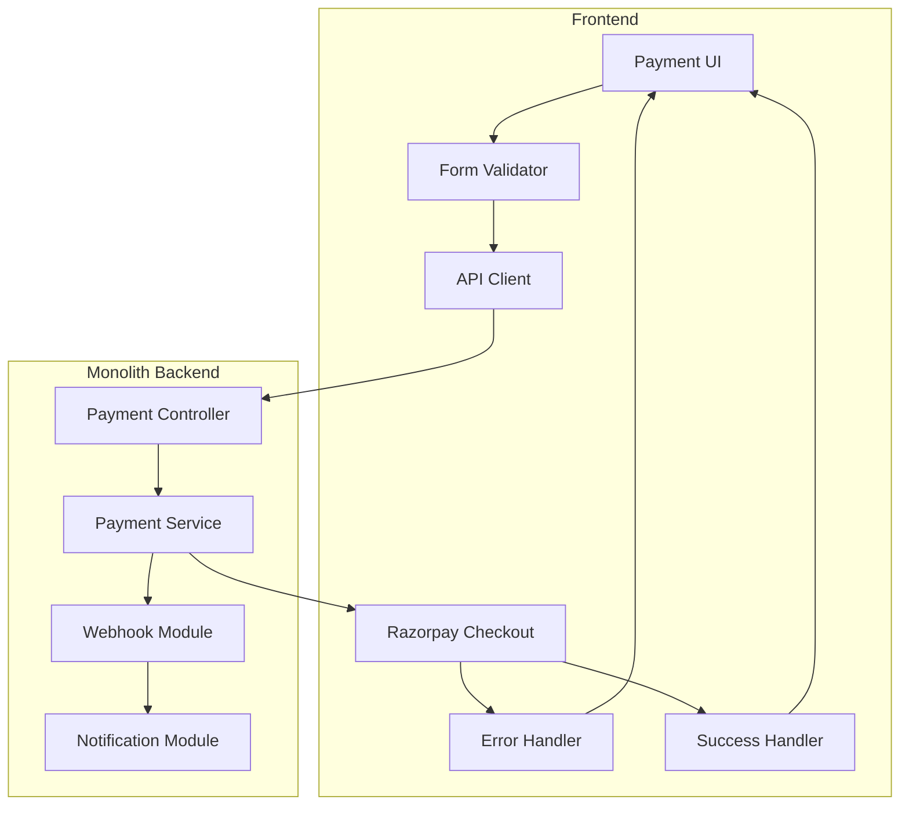

### **5.2 Subscription Management Flow (Monolith)**

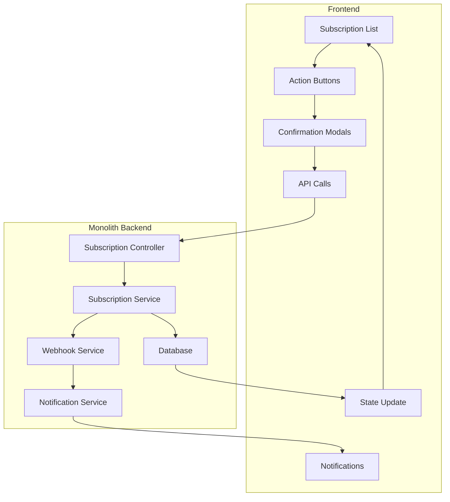

---

## 📊 **6. Data Flow Diagram**

### **6.1 Payment Data Flow (Monolith)**

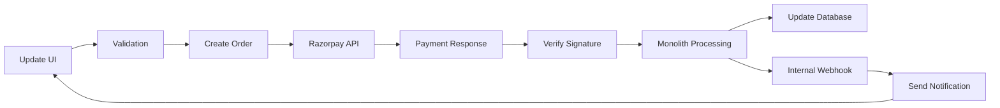

### **6.2 Subscription Data Flow (Monolith)**

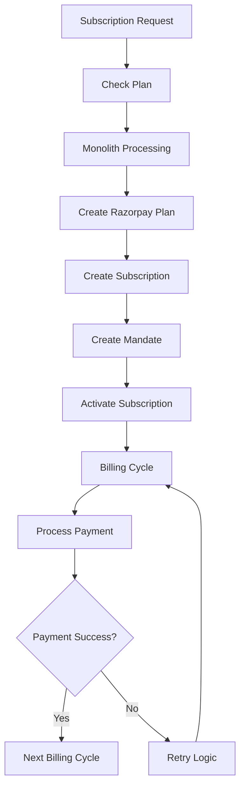

---

## 🛡️ **7. Security Architecture**

### **7.1 Security Layers**

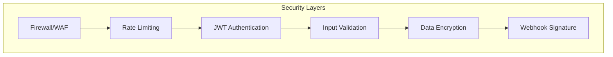

### **7.2 Security Implementation**

| Security Measure | Implementation |
|------------------|----------------|
| **Authentication** | JWT with refresh tokens |
| **Authorization** | Role-based access control |
| **Input Validation** | DTO validation with class-validator |
| **SQL Injection** | TypeORM parameterized queries |
| **XSS Protection** | React built-in protections |
| **CSRF Protection** | CSRF tokens for state-changing ops |
| **Webhook Security** | HMAC SHA256 signature verification |
| **Data Encryption** | AES-256 for sensitive data |
| **PCI Compliance** | No card data stored (Razorpay) |

---

## 📈 **8. Performance & Scalability**

### **8.1 Performance Metrics**

| Metric | Target | Measurement |
|--------|--------|-------------|
| **API Response Time** | <200ms | 95th percentile |
| **Payment Processing** | <3s | End-to-end |
| **Webhook Processing** | <500ms | 99th percentile |
| **Database Query Time** | <100ms | Average |
| **System Uptime** | 99.9% | Monthly |
| **Payment Success Rate** | >95% | Monthly |

### **8.2 Monolith Scalability Architecture**

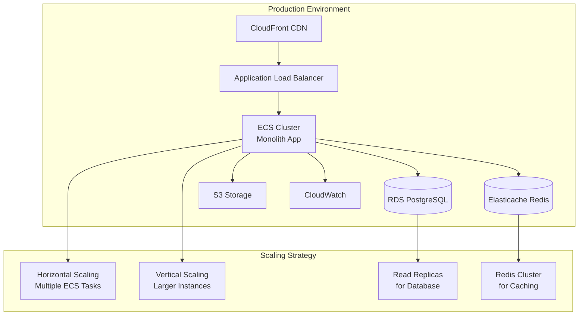

### **8.3 Monolith Scaling Strategies**

| Scaling Type | Implementation | When to Use |
|-------------|----------------|-------------|
| **Horizontal** | Add more ECS tasks | High traffic, load balancing |
| **Vertical** | Increase instance size | Memory/CPU intensive operations |
| **Database** | Read replicas, connection pooling | Database bottlenecks |
| **Cache** | Redis clustering | Cache misses, high load |
| **CDN** | CloudFront distribution | Static assets, global reach |

---

## 🔄 **9. Error Handling & Recovery**

### **9.1 Error Scenarios**

| Error Type | Handling Strategy | User Experience |
|------------|------------------|-----------------|
| **Payment Failure** | Retry 3x, notify user | "Payment failed, please try again" |
| **Network Timeout** | Auto-retry with exponential backoff | "Connection issue, retrying..." |
| **Webhook Failure** | Queue for retry, manual review | Silent retry, admin notification |
| **Database Error** | Fallback to read replica | "Service temporarily unavailable" |
| **Validation Error** | Immediate feedback | Field-specific error messages |

### **9.2 Monolith Recovery Mechanisms**

```typescript
// Retry Logic Example - Monolith Approach
@Injectable()
export class RetryService {
  constructor(
    private paymentsService: PaymentsService,
    private subscriptionsService: SubscriptionsService,
    private notificationsService: NotificationsService,
    private loggingService: LoggingService
  ) {}

  async retryPayment(orderId: string, maxRetries = 3): Promise<boolean> {
    for (let attempt = 1; attempt <= maxRetries; attempt++) {
      try {
        await this.paymentsService.processPayment(orderId);
        return true;
      } catch (error) {
        this.loggingService.error(`Payment retry failed - Attempt ${attempt}`, error);
        
        if (attempt === maxRetries) {
          await this.notifyAdmin(orderId, error);
          return false;
        }
        await this.delay(Math.pow(2, attempt) * 1000); // Exponential backoff
      }
    }
  }

  async handleWebhookFailure(webhookData: any, maxRetries = 5): Promise<void> {
    // Webhook retry logic within monolith
    for (let attempt = 1; attempt <= maxRetries; attempt++) {
      try {
        await this.processWebhook(webhookData);
        return;
      } catch (error) {
        this.loggingService.error(`Webhook retry failed - Attempt ${attempt}`, error);
        
        if (attempt === maxRetries) {
          await this.queueForManualReview(webhookData, error);
          return;
        }
        await this.delay(Math.pow(2, attempt) * 1000);
      }
    }
  }

  private async processWebhook(webhookData: any): Promise<void> {
    // Internal webhook processing within monolith
    switch (webhookData.event) {
      case 'payment.captured':
        await this.paymentsService.handlePaymentCaptured(webhookData);
        break;
      case 'subscription.activated':
        await this.subscriptionsService.handleSubscriptionActivated(webhookData);
        break;
      // Handle other webhook events
    }
  }

  private async notifyAdmin(orderId: string, error: any): Promise<void> {
    await this.notificationsService.sendAdminAlert({
      type: 'PAYMENT_FAILURE',
      orderId,
      error: error.message,
      timestamp: new Date()
    });
  }

  private async queueForManualReview(webhookData: any, error: any): Promise<void> {
    await this.notificationsService.sendAdminAlert({
      type: 'WEBHOOK_FAILURE',
      webhookId: webhookData.id,
      error: error.message,
      timestamp: new Date()
    });
  }

  private delay(ms: number): Promise<void> {
    return new Promise(resolve => setTimeout(resolve, ms));
  }
}
```

---

## 📱 **10. User Experience Flow**

### **10.1 Customer Journey**

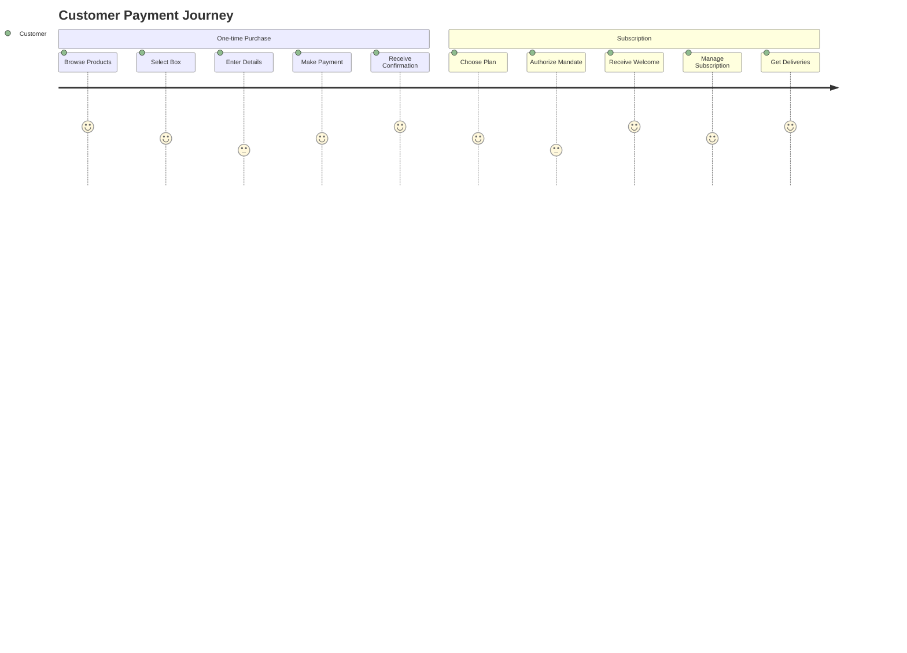

### **10.2 UI/UX Requirements**

| Component | Requirements |
|-----------|-------------|
| **Payment Form** | Clean, minimal fields, real-time validation |
| **Razorpay Checkout** | Seamless integration, custom branding |
| **Subscription Dashboard** | Clear status, easy management options |
| **Error Messages** | User-friendly, actionable, contextual |
| **Loading States** | Progress indicators, skeleton screens |
| **Mobile Responsive** | Optimized for all device sizes |

---

## 🧪 **11. Testing Strategy**

### **11.1 Test Coverage Requirements**

| Test Type | Coverage | Tools |
|-----------|----------|-------|
| **Unit Tests** | 80%+ | Jest, Supertest |
| **Integration Tests** | 70%+ | Jest, Test Database |
| **E2E Tests** | Key flows | Cypress, Playwright |
| **Load Testing** | 10x traffic | Artillery, K6 |
| **Security Testing** | OWASP Top 10 | OWASP ZAP, Burp Suite |

### **11.2 Test Scenarios**

```typescript
// Key Test Scenarios
describe('Payment Flow', () => {
  test('Successful payment flow');
  test('Payment failure handling');
  test('Invalid signature rejection');
  test('Concurrent payment processing');
  test('Webhook processing');
  test('Subscription lifecycle');
  test('Mandate authorization');
  test('Recurring payment processing');
});
```

---

## 🚀 **12. Deployment Architecture**

### **12.1 Monolith Deployment Architecture**

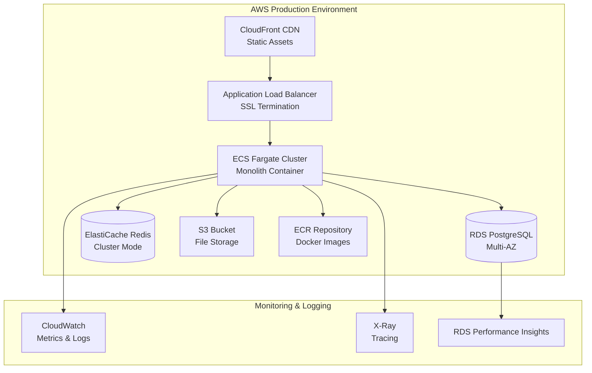

### **12.2 Monolith CI/CD Pipeline**

```yaml
# GitHub Actions - Monolith Deployment
name: Deploy Food D2C Monolith
on:
  push:
    branches: [main, develop]

env:
  AWS_REGION: us-east-1
  ECR_REPOSITORY: food-d2c-monolith
  ECS_SERVICE: food-d2c-service
  ECS_CLUSTER: food-d2c-cluster

jobs:
  test:
    runs-on: ubuntu-latest
    steps:
      - uses: actions/checkout@v3
      - name: Setup Node.js
        uses: actions/setup-node@v3
        with:
          node-version: '18'
          cache: 'npm'
      
      - name: Install dependencies
        run: npm ci
      
      - name: Run unit tests
        run: npm run test:coverage
      
      - name: Run integration tests
        run: npm run test:e2e
      
      - name: Security audit
        run: npm audit --audit-level high

  build:
    needs: test
    runs-on: ubuntu-latest
    steps:
      - uses: actions/checkout@v3
      
      - name: Configure AWS credentials
        uses: aws-actions/configure-aws-credentials@v2
        with:
          aws-access-key-id: ${{ secrets.AWS_ACCESS_KEY_ID }}
          aws-secret-access-key: ${{ secrets.AWS_SECRET_ACCESS_KEY }}
          aws-region: ${{ env.AWS_REGION }}
      
      - name: Login to Amazon ECR
        id: login-ecr
        uses: aws-actions/amazon-ecr-login@v1
      
      - name: Build Docker image
        run: |
          docker build -t $ECR_REPOSITORY:${{ github.sha }} .
          docker tag $ECR_REPOSITORY:${{ github.sha }} $ECR_REPOSITORY:latest
      
      - name: Push to ECR
        run: |
          docker push $ECR_REPOSITORY:${{ github.sha }}
          docker push $ECR_REPOSITORY:latest

  deploy:
    needs: build
    runs-on: ubuntu-latest
    steps:
      - name: Configure AWS credentials
        uses: aws-actions/configure-aws-credentials@v2
        with:
          aws-access-key-id: ${{ secrets.AWS_ACCESS_KEY_ID }}
          aws-secret-access-key: ${{ secrets.AWS_SECRET_ACCESS_KEY }}
          aws-region: ${{ env.AWS_REGION }}
      
      - name: Update ECS service
        run: |
          aws ecs update-service \
            --cluster $ECS_CLUSTER \
            --service $ECS_SERVICE \
            --force-new-deployment
      
      - name: Wait for deployment
        run: |
          aws ecs wait services-stable \
            --cluster $ECS_CLUSTER \
            --services $ECS_SERVICE
```

### **12.3 Docker Configuration**

```dockerfile
# Dockerfile - Monolith Application
FROM node:18-alpine AS builder

WORKDIR /app
COPY package*.json ./
RUN npm ci --only=production

COPY . .
RUN npm run build

FROM node:18-alpine AS runtime

RUN addgroup -g 1001 -S nodejs
RUN adduser -S nestjs -u 1001

WORKDIR /app
COPY --from=builder --chown=nestjs:nodejs /app/dist ./dist
COPY --from=builder --chown=nestjs:nodejs /app/node_modules ./node_modules
COPY --from=builder --chown=nestjs:nodejs /app/package.json ./package.json

USER nestjs

EXPOSE 3000

CMD ["node", "dist/main.js"]
```

### **12.4 ECS Task Definition**

```json
{
  "family": "food-d2c-monolith",
  "networkMode": "awsvpc",
  "requiresCompatibilities": ["FARGATE"],
  "cpu": "1024",
  "memory": "2048",
  "executionRoleArn": "arn:aws:iam::account:role/ecsTaskExecutionRole",
  "taskRoleArn": "arn:aws:iam::account:role/ecsTaskRole",
  "containerDefinitions": [
    {
      "name": "food-d2c-app",
      "image": "account.dkr.ecr.region.amazonaws.com/food-d2c-monolith:latest",
      "portMappings": [
        {
          "containerPort": 3000,
          "protocol": "tcp"
        }
      ],
      "environment": [
        {
          "name": "NODE_ENV",
          "value": "production"
        }
      ],
      "secrets": [
        {
          "name": "DB_PASSWORD",
          "valueFrom": "arn:aws:secretsmanager:region:account:secret:food-d2c-db-password"
        },
        {
          "name": "RAZORPAY_KEY_SECRET",
          "valueFrom": "arn:aws:secretsmanager:region:account:secret:food-d2c-razorpay"
        }
      ],
      "logConfiguration": {
        "logDriver": "awslogs",
        "options": {
          "awslogs-group": "/ecs/food-d2c",
          "awslogs-region": "us-east-1",
          "awslogs-stream-prefix": "ecs"
        }
      },
      "healthCheck": {
        "command": ["CMD-SHELL", "curl -f http://localhost:3000/health || exit 1"],
        "interval": 30,
        "timeout": 5,
        "retries": 3,
        "startPeriod": 60
      }
    }
  ]
}
```

---

## 📊 **13. Monitoring & Analytics**

### **13.1 Key Metrics Dashboard**

| Metric | Description | Alert Threshold |
|--------|-------------|-----------------|
| **Payment Success Rate** | % of successful payments | <95% |
| **API Response Time** | Average response time | >500ms |
| **Error Rate** | % of failed requests | >5% |
| **Subscription Churn** | Monthly churn rate | >10% |
| **Revenue MRR** | Monthly recurring revenue | - |
| **Active Subscriptions** | Current active count | - |

### **13.2 Monolith Monitoring Implementation**

```typescript
// Metrics Collection - Monolith Approach
@Injectable()
export class MetricsService {
  constructor(
    private datadog: DatadogService,
    private loggingService: LoggingService
  ) {}

  async trackPaymentEvent(event: string, amount: number, status: string) {
    await this.datadog.increment('payment.events', {
      event_type: event,
      status: status,
      amount: amount,
      architecture: 'monolith'
    });
  }
  
  async trackSubscriptionEvent(event: string, subscriptionId: string) {
    await this.datadog.increment('subscription.events', {
      event_type: event,
      subscription_id: subscriptionId,
      architecture: 'monolith'
    });
  }

  async trackModulePerformance(module: string, operation: string, duration: number) {
    await this.datadog.histogram('module.performance', duration, {
      module: module,
      operation: operation,
      architecture: 'monolith'
    });
  }

  async trackDatabaseQuery(query: string, duration: number, success: boolean) {
    await this.datadog.histogram('database.query.duration', duration, {
      query_type: query,
      success: success,
      architecture: 'monolith'
    });
  }

  async trackWebhookProcessing(eventType: string, processingTime: number, success: boolean) {
    await this.datadog.histogram('webhook.processing.duration', processingTime, {
      event_type: eventType,
      success: success,
      architecture: 'monolith'
    });
  }
}

// Health Check - Monolith Approach
@Controller('health')
export class HealthController {
  constructor(
    private databaseService: DatabaseService,
    private cacheService: CacheService,
    private razorpayService: RazorpayService
  ) {}

  @Get()
  @HealthCheck()
  async check() {
    const results = await Promise.allSettled([
      this.checkDatabase(),
      this.checkCache(),
      this.checkRazorpay(),
      this.checkMemory(),
      this.checkDiskSpace()
    ]);

    return {
      status: results.every(r => r.status === 'fulfilled') ? 'healthy' : 'unhealthy',
      timestamp: new Date(),
      architecture: 'monolith',
      checks: {
        database: results[0].status === 'fulfilled' ? 'healthy' : 'unhealthy',
        cache: results[1].status === 'fulfilled' ? 'healthy' : 'unhealthy',
        razorpay: results[2].status === 'fulfilled' ? 'healthy' : 'unhealthy',
        memory: results[3].status === 'fulfilled' ? 'healthy' : 'unhealthy',
        disk: results[4].status === 'fulfilled' ? 'healthy' : 'unhealthy'
      }
    };
  }

  private async checkDatabase(): Promise<void> {
    await this.databaseService.query('SELECT 1');
  }

  private async checkCache(): Promise<void> {
    await this.cacheService.ping();
  }

  private async checkRazorpay(): Promise<void> {
    await this.razorpayService.ping();
  }

  private async checkMemory(): Promise<void> {
    const memUsage = process.memoryUsage();
    if (memUsage.heapUsed > memUsage.heapTotal * 0.9) {
      throw new Error('High memory usage');
    }
  }

  private async checkDiskSpace(): Promise<void> {
    // Check disk space implementation
  }
}
```

---

## 🎯 **14. Success Criteria**

### **14.1 Technical KPIs**

- **99.9% uptime** for payment services
- **<200ms average** API response time
- **95%+ payment success rate**
- **<1% webhook processing failures**
- **100% data consistency** across systems

### **14.2 Business KPIs**

- **40% increase** in MRR within 6 months
- **60% reduction** in payment failures
- **35% improvement** in customer retention
- **10,000+ active subscriptions** by end of year
- **4.8/5 customer satisfaction** score

---

## 📅 **15. Implementation Timeline**

### **Phase 1: Core Implementation (4 weeks)**
- Week 1: Payment service development
- Week 2: Subscription service development
- Week 3: Webhook implementation
- Week 4: Frontend integration

### **Phase 2: Testing & Security (2 weeks)**
- Week 5: Comprehensive testing
- Week 6: Security audit & hardening

### **Phase 3: Production Deployment (2 weeks)**
- Week 7: Infrastructure setup
- Week 8: Production deployment & monitoring

---

## 🔄 **16. Future Enhancements**

### **16.1 Planned Features**

- **Multiple Payment Methods**: UPI, Net Banking, Wallets
- **International Payments**: Multi-currency support
- **Advanced Analytics**: Customer behavior insights
- **AI-Powered Recommendations**: Personalized plans
- **Mobile App**: Native iOS/Android applications

### **16.2 Monolith Evolution Roadmap**

#### **Phase 1: Monolith Foundation (Current)**
- Single NestJS application
- Modular architecture within monolith
- Shared database and caching
- Integrated deployment pipeline

#### **Phase 2: Monolith Optimization (6-12 months)**
- **Database Optimization**: Read replicas, connection pooling
- **Caching Strategy**: Redis clustering, application-level caching
- **Performance Tuning**: Query optimization, lazy loading
- **Monitoring Enhancement**: Advanced metrics, distributed tracing

#### **Phase 3: Strategic Decomposition (12-24 months)**
**When to consider microservices:**
- Team size grows beyond 10-15 developers
- Different modules have independent scaling needs
- Deployment cycles become bottleneck
- Technology diversity requirements emerge

**Potential Service Boundaries:**
```
Monolith → Strategic Split
├── Auth Service → Independent auth microservice
├── Payment Service → Payment processing microservice
├── Subscription Service → Subscription management microservice
├── Notification Service → Notification microservice
└── Webhook Service → Event processing microservice
```

#### **Phase 4: Full Microservices (24+ months)**
- **Event-Driven Architecture**: Kafka/RabbitMQ integration
- **API Gateway**: Centralized routing and security
- **Service Mesh**: Inter-service communication
- **Independent Databases**: Service-specific data stores

### **16.3 Monolith to Microservices Migration Strategy**

| Migration Approach | When to Use | Complexity |
|-------------------|-------------|------------|
| **Strangler Fig Pattern** | Gradual migration | Medium |
| **Parallel Run** | Critical services | High |
| **Database Decomposition** | Data isolation needed | High |
| **Event-First** | New features only | Low |

#### **Migration Triggers:**
- **Performance**: Module-specific performance issues
- **Scaling**: Different scaling requirements per module
- **Team**: Multiple teams working on same codebase
- **Technology**: Need for different tech stacks

#### **Stay Monolith If:**
- Team size < 10 developers
- Single deployment frequency is acceptable
- Shared data model is beneficial
- Infrastructure costs are concern

---

## 📝 **17. Conclusion**

This PRD outlines a comprehensive, production-ready payment and subscription system for Food D2C. The architecture balances security, performance, and user experience while ensuring scalability for future growth.

**Key Success Factors:**
- Robust error handling and recovery mechanisms
- Real-time webhook processing
- Comprehensive security measures
- Excellent user experience
- Scalable architecture design

**Next Steps:**
1. Review and approve technical architecture
2. Begin Phase 1 implementation
3. Set up development and testing environments
4. Establish monitoring and alerting systems

---

*This document serves as the single source of truth for the Food D2C payment and subscription system implementation.*
